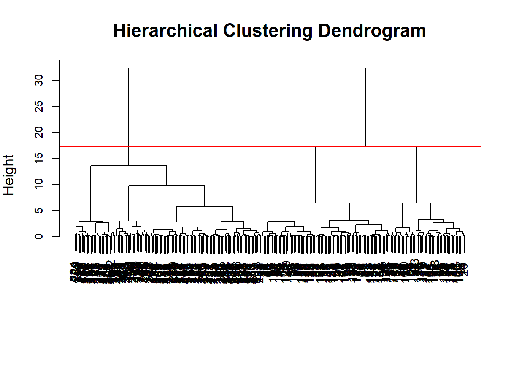

# SticksKebobShop: Customer Segmentation for Expansion

Who are Sticks Kebob Shop's customers, and where should the chain open next? This project segments survey respondents and turns the segments into a location recommendation.

## At a glance

| | |
|---|---|
| **Role** | Analyst (segmentation, clustering) |
| **Stack** | R (PCA, hierarchical clustering, silhouette), Python (data cleaning) |
| **Data** | Customer and non-customer surveys on fast-food choice |
| **Context** | UC Riverside MSBA project |
| **Key result** | Profiled distinct customer segments and recommended the next-location type from their demographics |

## Problem & context

Sticks Kebob Shop, a quick-service chain, wants to expand, but expansion should follow the customers. Using surveys of customers and non-customers, this project asks who visits and why, groups respondents into segments, and translates those segments into where a new store would do best.

## Approach

- **Data cleaning:** prepared the customer and non-customer survey responses in Python.
- **Feature selection:** kept the survey questions that most drive restaurant choice.
- **Dimensionality reduction:** ran PCA to compress the questionnaire into its main dimensions.
- **Clustering:** used the silhouette method to choose the number of clusters, then hierarchical clustering to assign segments.
- **Profiling and recommendation:** described each segment's demographics and behavior, then mapped them to location types.

## Key findings

- Respondents split into distinct segments, including a health-conscious, convenience-driven group that fits Sticks' positioning.
- Segment profiles pointed to specific location types: urban business districts for the health-conscious planner segment, and suburban family communities for others.
- The analysis gives the chain a targeting and site-selection rationale grounded in customer data rather than intuition.

## Repo guide

- `Codes/`: Python notebooks (data cleaning) and the R Markdown segmentation analysis.
- `Datasets/`: raw and cleaned customer and non-customer survey data.
- `Outputs/`: the rendered analysis and the slide deck.
- `assets/hero.png`: hierarchical clustering dendrogram of survey respondents.

**Reproduce:** run the cleaning notebooks in `Codes/`, then knit the R Markdown to reproduce the PCA, clustering, and segment profiles.

---

Tools: R · PCA · hierarchical clustering · Python · survey analytics
Part of my portfolio: https://visheshshukla.netlify.app

_Team academic project (UC Riverside MSBA). Survey data collected for the course._
